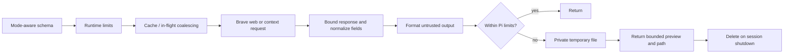
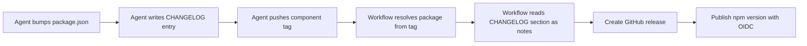

# Architecture

This repository publishes independent Pi extensions from `packages/*`. Each package is loaded directly
from TypeScript, owns its runtime dependencies, and can be installed without the rest of the workspace.
For setup and package behavior, use the package READMEs. For trust-boundary requirements, see
[security invariants](security-invariants.md); for publishing mechanics, see the
[release guide](release.md).

## Package boundaries

Package manifests remain independently publishable and expose one Pi entry point, `src/index.ts`.
Pi-provided APIs are peer dependencies because the host supplies them. The root workspace provides a
locked development resolution and smoke-tests the packed extensions against that resolution.

`pi-web-fetch` and `pi-web-search` intentionally contain byte-identical copies of `cache.ts`,
`inflight.ts`, and `render.ts`. This keeps both npm packages independent and avoids creating a shared
runtime package for three small utilities. `tests/repository-contract.test.ts` detects drift. Extract
a shared package only if another consumer appears or synchronized maintenance becomes materially
burdensome. Do not extract only part of web-fetch's validate–resolve–pin–redirect security boundary.

## Web fetch

```mermaid
flowchart LR
  A[Tool arguments] --> B[Schema and runtime bounds]
  B --> C[Cache / in-flight coalescing]
  C --> D[Validate URL]
  D --> E[Resolve every DNS answer]
  E --> F[Reject non-global addresses]
  F --> G[Request pinned address]
  G --> H{Redirect?}
  H -- yes --> D
  H -- no --> I[Bound response bytes and media type]
  I --> J[Extract HTML or decode text]
  J --> K[Cache complete document]
  K --> L[Slice continuation]
  L --> M[Wrap and bound untrusted output]
```

The validated address is passed to the transport, while the original hostname remains available for
TLS and HTTP host validation. Every redirect restarts validation and receives a new pinned target.
Timeout and caller cancellation cover resolution, transport, and extraction. The cache stores the
complete extracted document so continuation offsets remain stable; each caller still has independent
cancellation through the in-flight coalescer.

The blocked-address table is maintained in `packages/pi-web-fetch/src/network-policy.ts` against the
[IANA IPv4](https://www.iana.org/assignments/iana-ipv4-special-registry/iana-ipv4-special-registry.xhtml)
and [IANA IPv6](https://www.iana.org/assignments/iana-ipv6-special-registry/iana-ipv6-special-registry.xhtml)
special-purpose registries; its table comment records the latest review date (2026-08-03). Boundary
tests exercise every range endpoint. Review the registries at least quarterly and record the review
date beside the table even when no range changes. Registry changes require a security
review that preserves DNS-answer validation, address pinning, and redirect revalidation; update the
explicit endpoint fixtures from the registry data rather than accepting generated ranges without
review.

## Web search

The API key is read at request time only and is excluded from cache keys, output, and errors. Web mode
returns normalized provider links and snippets. Context mode uses only Brave's context endpoint; it
does not fetch result URLs. Identical requests coalesce, but cancellation remains per caller. Large
formatted results are written under a package-owned temporary directory and removed after write
failure or session shutdown.

## Release automation

`scripts/release.ts` resolves a `<package>-v<version>` tag to its package and
verifies the tag version matches the manifest version. It then reads the
package's `CHANGELOG.md` section for the released version and writes it to a
notes file consumed by `gh release create`, which creates the GitHub release via the GitHub CLI. The
workflow publishes the package through npm trusted publishing (OIDC). The agent
owns the version and changelog; the workflow only reads them. Details, approvals,
and escalation conditions remain in [release.md](release.md).

Note: `repository-contract.test.ts` is a vitest suite run via `vp run test:contracts` (and
covered by `vp test`). `package-smoke-test.ts` remains an executable smoke-test script run from
`tests/` via `vp run test:packages`; it is not a vitest suite.
