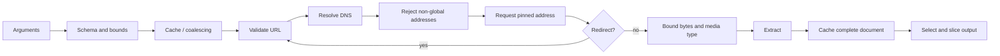
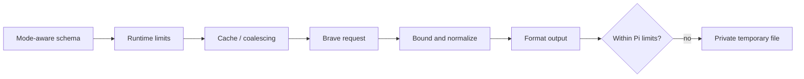

# Architecture

This repository publishes independent Pi extensions from `packages/*`. Each package loads directly from TypeScript, owns runtime dependencies, and can be installed without the rest of the workspace. Package behavior is documented in the package READMEs; development and release procedures are in [development.md](development.md) and [release.md](release.md).

## Package boundaries

Each manifest exposes one Pi entry point, `src/index.ts`. Pi APIs are peer dependencies because the host supplies them; the workspace provides a locked development resolution and smoke-tests packed extensions.

`pi-web-fetch` and `pi-web-search` contain byte-identical copies of `cache.ts`, `inflight.ts`, and `render.ts`. `tests/repository-contract.test.ts` detects drift. Extract a shared runtime package only if another consumer appears or synchronized maintenance becomes materially burdensome. Do not extract only part of web-fetch's validate–resolve–pin–redirect security boundary.

## Web fetch trust boundary

The validated address is passed to the transport while the original hostname remains available for TLS and HTTP host validation. Every redirect repeats validation and receives a new pinned target. Resolution, transport, extraction, queueing, retries, and backoff are timeout- and caller-cancellation-aware. Raw responses, retry bodies, extracted content, and output are bounded.

The cache stores the complete extracted document; focused selection derives a separate view without mutating it. Fresh entries are hits. Stale entries may be conditionally revalidated for a bounded window using `ETag` or `Last-Modified`; `304` refreshes the canonical entry. Evidence distinguishes hits, revalidations, and misses.

Retryable `429` and `503` responses honor capped `Retry-After` values or capped jittered backoff with a fixed attempt limit. Origin coordination bounds concurrent request starts.

HTML evidence distinguishes JavaScript-required pages, bot walls, consent interstitials, and sparse extraction. Links are bounded metadata only; unsafe schemes and credentials are rejected, and links are never traversed implicitly.

The blocked-address table in `packages/pi-web-fetch/src/network-policy.ts` follows the [IANA IPv4](https://www.iana.org/assignments/iana-ipv4-special-registry/iana-ipv4-special-registry.xhtml) and [IPv6](https://www.iana.org/assignments/iana-ipv6/iana-ipv6-special-registry/iana-ipv6-special-registry.xhtml) special-purpose registries. Review it at least quarterly, record the date beside the table, and update endpoint fixtures from reviewed registry data. Registry changes require a security review preserving DNS-answer validation, address pinning, and redirect revalidation.

## Web search boundary

The API key is read at request time and excluded from cache keys, output, and errors. Context mode uses only Brave's context endpoint and never fetches result URLs. Large formatted results use a package-owned temporary directory and are removed after write failure or session shutdown.

## Data flow invariants

Keep acquisition, canonical storage, selection, and presentation separate. Cache complete bounded source representations and derive focused or ranked views locally. Derived views report selected or omitted content, preserve source order when practical, and retain deterministic continuation offsets. Relevance and extraction signals describe processing, not source authority or calibrated confidence.

All network optimizations—including revalidation, retries, metadata probes, and redirects—must use the complete transport security boundary. Do not add a client that bypasses validation, pinning, limits, cancellation, or redirect checks. Expensive rendering and autonomous multi-page traversal are not implicit fallbacks.
